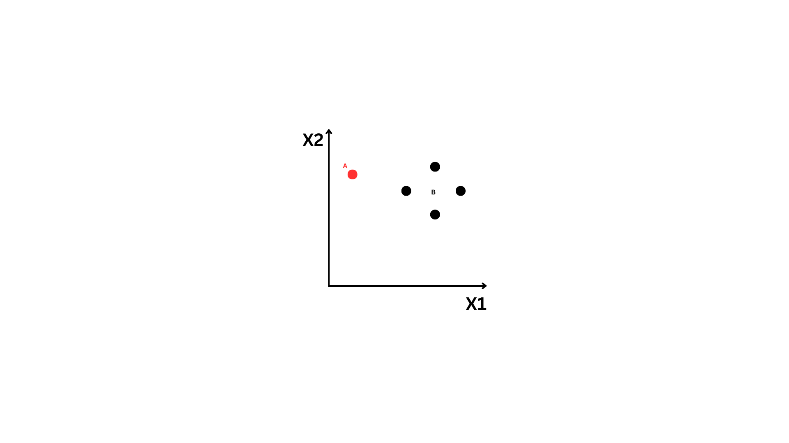
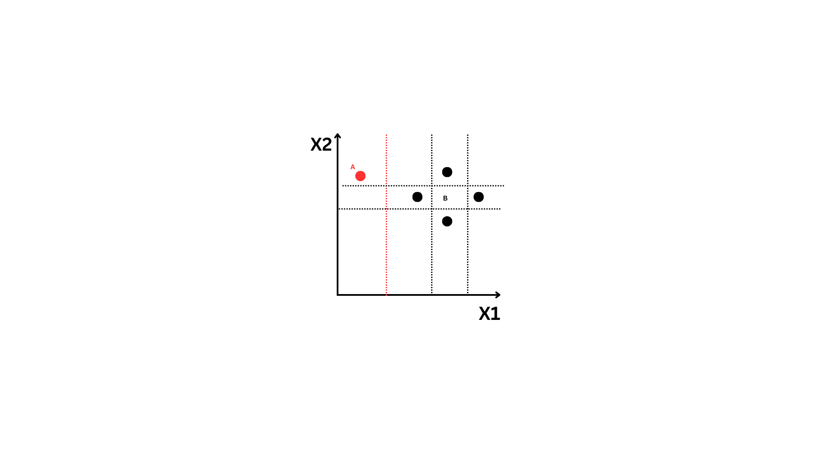
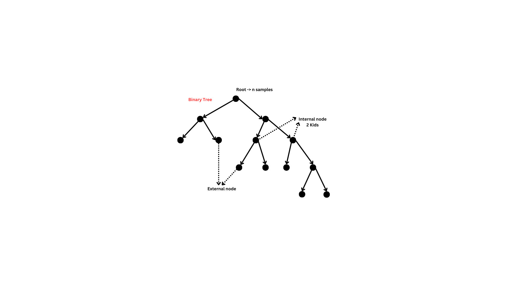

# Anomaly Detection Research Project

## SECTION I: Anomaly Detection Overview

### Defining Anomaly Detection

1. **Data**: \( x(1), x(2),..., x(n) \) where all values of \( x \) belong to a \( d \)-dimensional real space.
2. **Types**: Mixture of nominal and anomaly points.
3. **Anomaly Generation**: Anomaly points are generated by a different generative process than the normal points.

### Three Settings

1. **SUPERVISED**:
   - Training data labeled with "nominal" and "anomaly".
   - Severe class imbalance possible.
2. **CLEAN**:
   - Training data are all "nominal".
   - Test data contaminated with "anomaly" points.
   - Open category case.
3. **UNSUPERVISED**:
   - Training data consists of a mixture of "nominal" and "anomaly" points.

### Well-Defined Anomaly Distribution Assumption (WDAD)

1. **WDAD**: Anomalies are drawn from a well-defined probability distribution.
   - Example: Repeated instances of known machine failures.
2. **Risks of WDAD Assumption**:
   - Adversarial situations (e.g., fraud, insider threats, cybersecurity).
   - Diverse set of potential causes (e.g., novel device failure modes).
   - Users' notion of "anomaly" changes over time (e.g., anomaly == "interesting point").

### Strategies for Unsupervised Anomaly Detection

- **Let α be the fraction of training points that are anomalies**.

#### CASE 1: α is large (e.g., > 5%)

1. **Fit a 2-component mixture model**:
   - Model both normal and anomaly distributions.
   - Requires WDAD assumption.
   - Mixture components must be identifiable.
   - Components must not have large overlap in high-density regions.

#### CASE 2: α is small (e.g., 1%, 0.1%, 0.01%, 0.001%)

1. **Anomaly Detection via Outlier Detection**:
   - Does not require WDAD assumption.
   - May fail if anomalies are not outliers (e.g., overlap with nominal density).
   - May fail if nominal distribution has heavy tails.

## SECTION II: Benchmarking Study by Andrew Emmott

1. **Evaluation Concerns**:
   - Most anomaly detection (AD) papers evaluate on only a few datasets.
   - Often proprietary or very easy (e.g., KDD 1999).
   - Research community needs a large and growing collection of public anomaly benchmarks.

## SECTION III: Algorithms

### 1. Z-score

- **Concept**:

  - Standard Normal Distribution:
    - Mean (µ) = 0
    - Standard Deviation (σ) = 1
    - Always centered at zero, intervals increase or decrease by 1.
  - Formula: \( Z = {x - µ}/{σ})
    - Where:
      - \( x \) is the data point.
      - \( µ \) is the mean of the dataset.
      - \( σ \) is the standard deviation.

- **How it Works**:

  - Normal data points have Z-scores close to 0.
  - Anomalies have Z-scores far from 0 (e.g., > 3 or < -3).

- **Advantages**:

  - Simple and easy to implement.

- **Limitations**:
  - Assumes data follows a normal distribution (Gaussian), may not work well with skewed or heavy-tailed distributions.

### 2. Moving Average-Based Anomaly Detection

- **Concept**:

  - Compare the current value in a data stream to the moving average of previous values.

- **Key Parameters**:
  - **Window**: Number of previous values to include in the moving average (default is 10).
  - **Threshold**: Acceptable deviation before classifying a value as an anomaly (default is 2.0).

### 3. Isolation Forest

- **Features**:

  - Fast, accurate, and works with large datasets.
  - No feature scaling required.
  - No need to calculate distances (protects against the curse of dimensionality).
  - Memory-friendly.

- **Basic Idea**:

  - Anomalous points take fewer splits to isolate.
  - **Random Forest**:
    - You have a dataset D . Split the dataset into subsamples D(i) and build trees.
    - Subsample with replacement.
    - Size of D(i) is the same as D i.e Size D = Size D(i).
    - Build trees resulting in models h(1) to h(n).
    - Split until all points are isolated (clear overfitting).
    - Split on k features where k < d.
    - Average classifier result across all classifiers.

   
- **Implementation**:
  - Anomalous points are isolated faster.
  - Do not split all the way down; set a limit on tree depth.
  - Average path length across trees determines anomaly score.
  - Shorter path length indicates a higher anomaly score.
